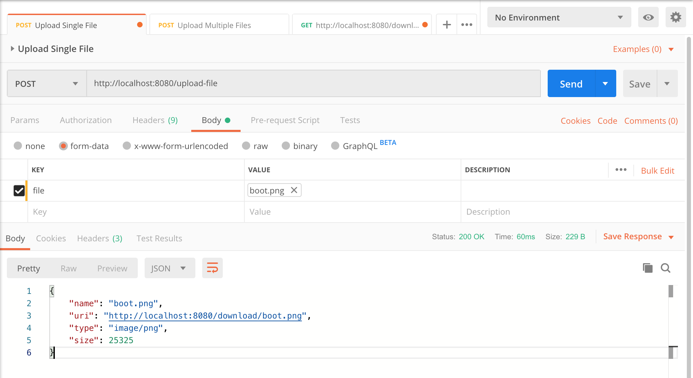
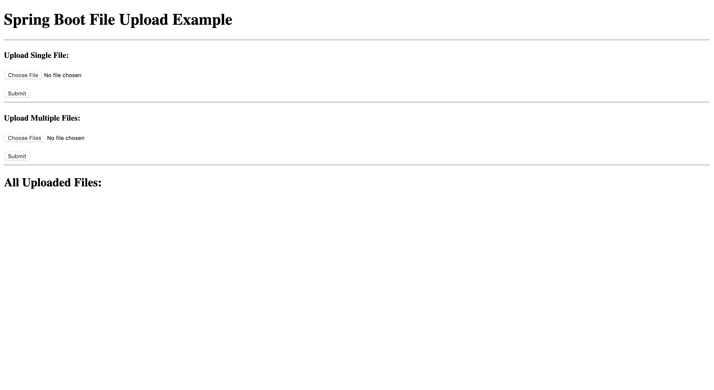
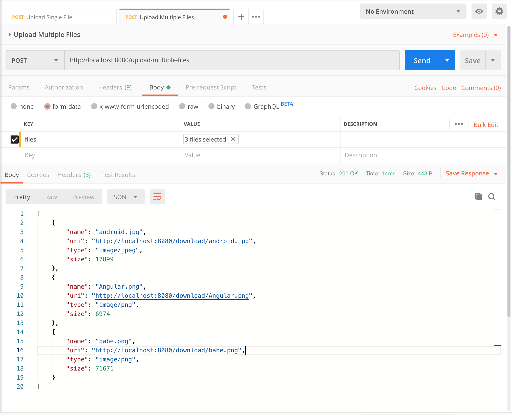
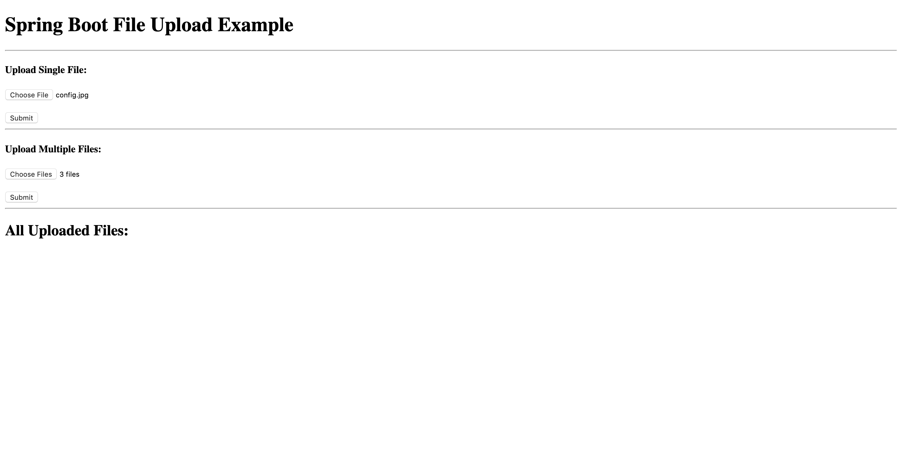
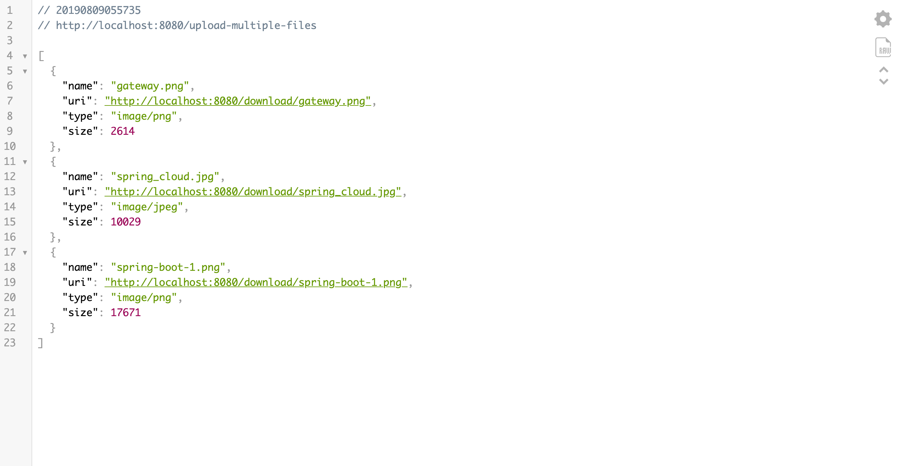
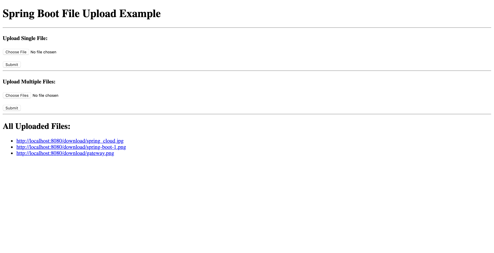

# springboot-upload-files-demo
As always, our controller class is annotated with @Controller to let the Spring MVC pick it up for routes. Each method is decorated with @GetMapping or @PostMapping to bind the path and the HTTP action with that particular method.

    GET / loads the current list of uploaded files and renders it into a Thymeleaf template called listFiles.html.
    POST /download/{filename} resolves the resource if it exists, and sends it to the browser for download. HttpHeaders.CONTENT_DISPOSITION adds the "Content-Disposition" response header to indicate file attachment.
    POST /upload-file & /upload-multipe-files routes handle HTTP multi-part requests and use StorageService for saving files on the server. Both these methods return an object of FileResponse after the upload is finished.

The FileResponse class is used to return a JSON response for RESTful web services.

## Running & Testing the Application

We are almost done with our backend development. Since we created RESTful APIs for uploading and downloading files, we can test them via Postman. Let's run the application by typing the following command in your terminal from the root directory of the project:
```
$ ./gradlew clean bootRun
```
Once the application is started, you can access it at http://localhost:8080.

1. Upload Single File

    


2. Upload Multiple Files




3. Download File



